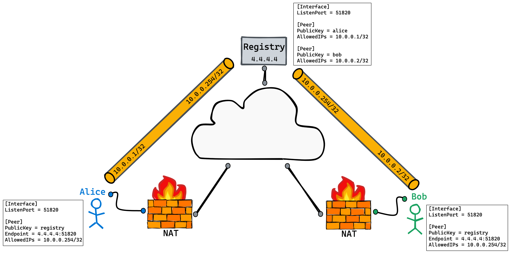

#What is wg-wormhole
`wg-wormhole` is a UDP hole punching tool base on wireguard

Please note that this is a **toy project**, or `Proof of concept`

### use cases:

- When you have a few devices under different networks. Some of them are behind NAT network. For instance, You are using the China mobile Broadband and they usually don't provide public IP. In the meantime, you are in somewhere without public IP too and you want to access your devices at home. Then you can use wg-wormhole to create your personal network to access your private devices. 

Actually, Wireguard create a private network for you. But it is your responsbility to ensure all peers can connect to each other such as using public IP. And of course you can use this trick to make it possible even you don't have allocated any public IP. 


You can find more details on this article: https://www.jordanwhited.com/posts/wireguard-endpoint-discovery-nat-traversal/, which introduces a `wgsd-client`. Instead of using CoreDNS to maintain those peer information, `wg-wormhole` implements it with gRPC. It almost always do the same things.


# How it works

It includes two parts:

- A registry service
- A series of nodes

However, It doesn't mean this is any new kind of proxy or something like that. All your network packets will be
sent to other peer directly without the registry to forward. This is totally different with `frp`.
The registry is just a map for your peers to find other endpoints. 


1. Both Alice and Bob are under NAT network.
2. But there is a registry with a public IP/Domain
3. Alice and Bot add the registry as a peer
4. Wireguard from Alice and Bob will connect to the reigstry automatically as long as they have correct config.
5. Registry now know the IP(endpoint) of Alice and Bob(2.2.2.2 and 3.3.3.3). because they have created a UDP  connection via wireguard

```bash

hoyho@instance-1:~$ sudo wg show #from registry
interface: wg0
  public key: [public_key_of_registry]
  private key: (hidden)
  listening port: 51820

peer: [public_key_of_alice]
  endpoint: 2.2.2.2:5516
  allowed ips: 10.0.0.1/32
  latest handshake: 29 seconds ago
  transfer: 196.70 KiB received, 22.25 KiB sent

peer: [public_key_of_bob]
  endpoint: 3.3.3.3:5402
  allowed ips: 10.0.0.2/32
  latest handshake: 2 hours, 5 minutes, 5 seconds ago
  transfer: 1.23 MiB received, 127.85 KiB sent

```

Alice and bob might got a private IP such as 192.168.2.2. However, after the wireguard connection established. The registry will record their public IP and port. let's name it as the `whole`

6. In this case, If we take some methods to update Alice and Bob's config using the query value from  registry. More specifically, Update the endpoint address of Bob in Alices's wireguard config. And Update the endpoint address of Alice in Bob's config. Then Alice and Bob can communicate with each other directly without foward their packets to any proxy node or registry node

In a word, the wg-wormhole do the majority works of step 5 and 6

# Try it yourself

1. build it
`make build` 
then you will got a binary wormhole

2. on the registry
```bash
./wormhole registry -t replace_this_with_your_own_token -i wg0
```

you can add -h for some help infos
```bash

❯ ./wormhole registry -h
The `registry` command starts a registry service.

Usage:
  wormhole registry [flags]

Flags:
  -a, --address string   rpc service listening address (default ":1638")
  -h, --help             help for registry
  -i, --ifcae string     the wireguard interface used for registry
  -t, --token string     token for a simple verificatio
```

` --address` the rpc server listening address. It handle the client call from nodes.
`--ifcae` your wireguard interface on registry machine, such as `wg0`, you can run `wg show` to check with it
`--token` a very simply verify token for your newtowk communication. This is not a real authentication !!!


3. on the node

Assume you have launched the wireguard on your node and registry. 
start the node by running:
```bash
./wormhole node -a your.registry.domain.or.ip:1638 -t replace_this_with_your_own_token
```


you can add -h for some help infos
```bash
The `node` command starts a node service.

Usage:
  wormhole node [flags]

Flags:
  -a, --address string     remote rpc address of registry
  -h, --help               help for node
  -i, --iface string       the wireguard interface used for this node [optional] 
  -r, --refresh duration   refresh interval for the peers (default 15s)
  -t, --token string       token for a simple verification
```

` --address` the rpc server address of a registry service 
`--ifcae` your wireguard interface on this machine, such as `wg0`, leave it empty if you don't want limit to specific interface(It will search all wireguard interfaces by default).
`--token` a very simply verify token for your newtowk communication. This is not a real authentication !!!
`--refresh` an interval to resync peers from registry, such as `15s`, `1m`


# Test it

